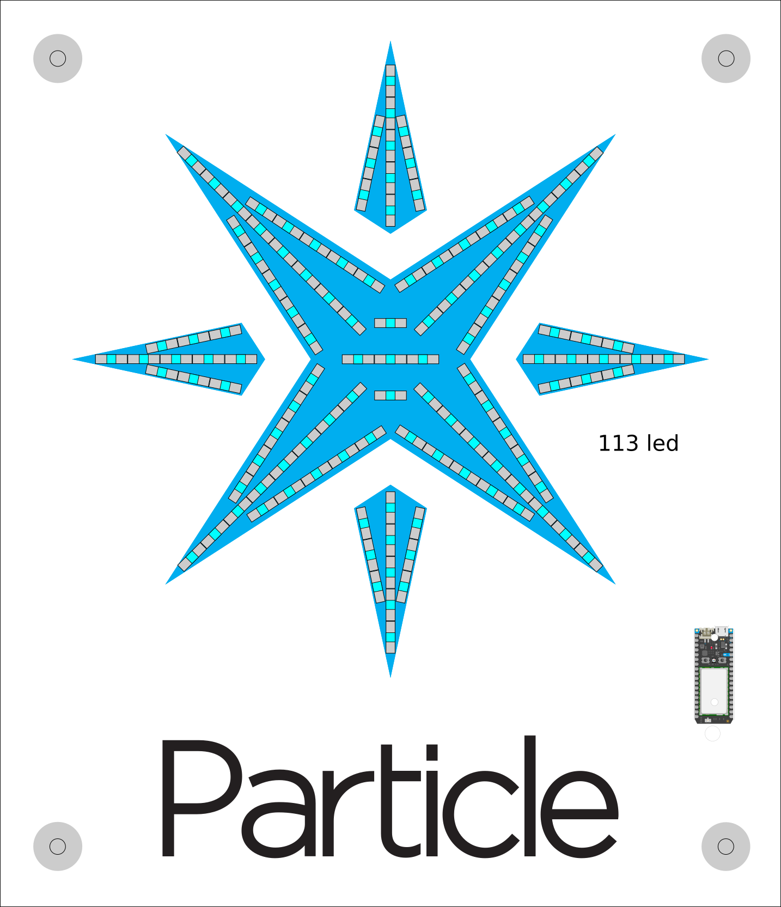
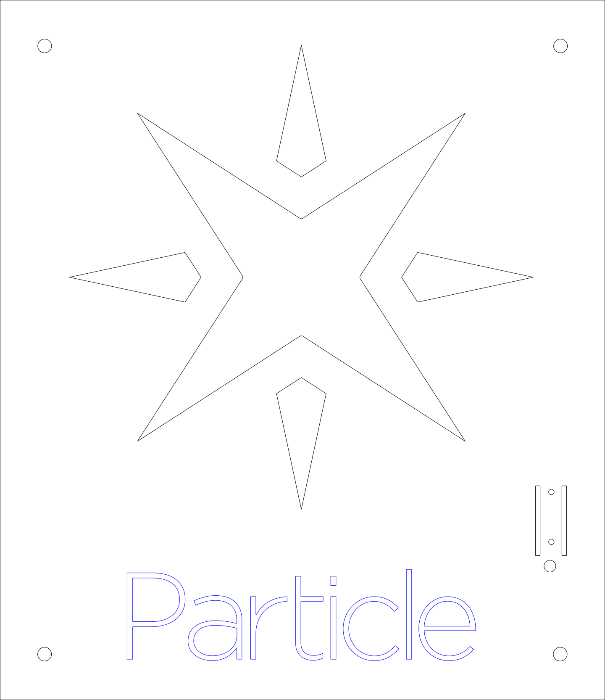
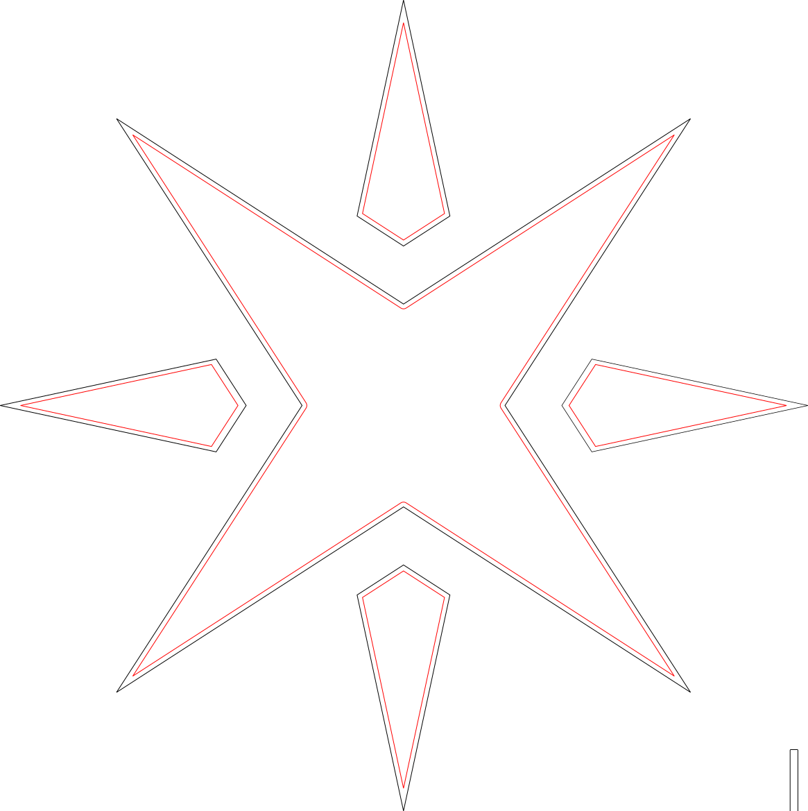
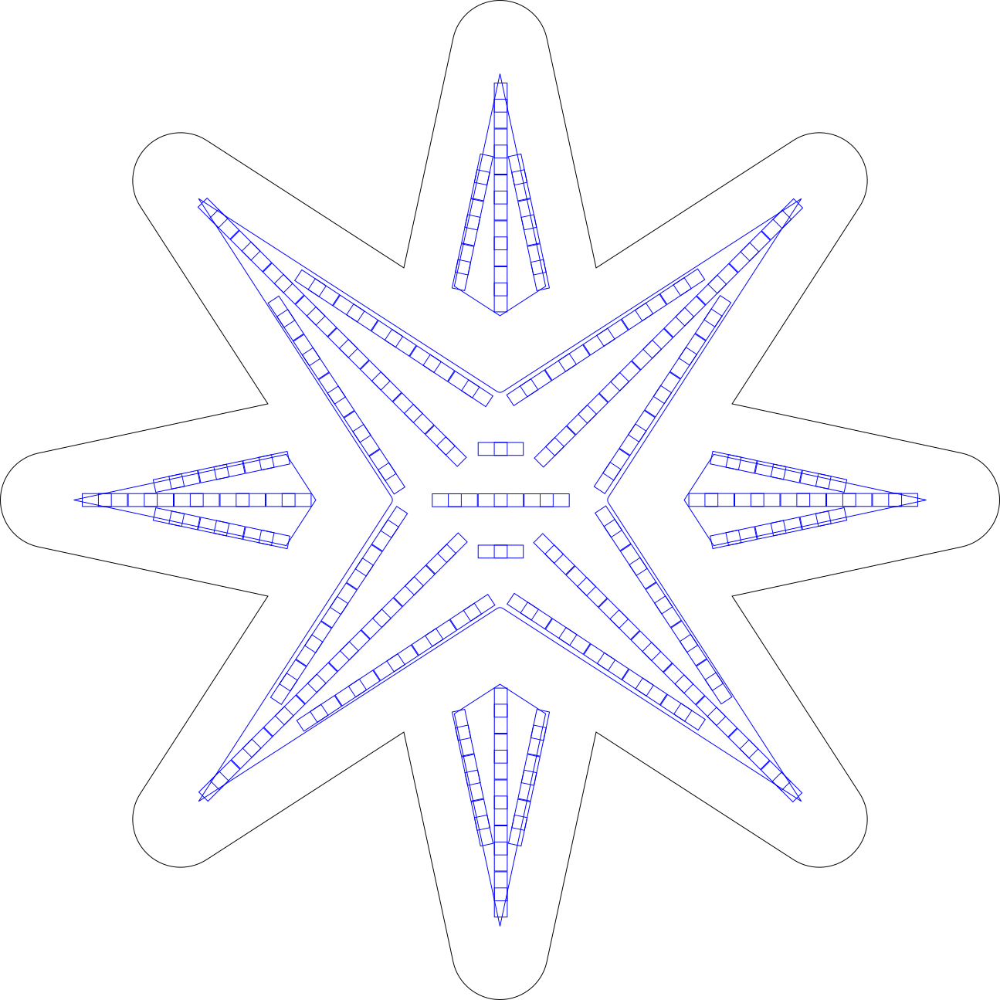
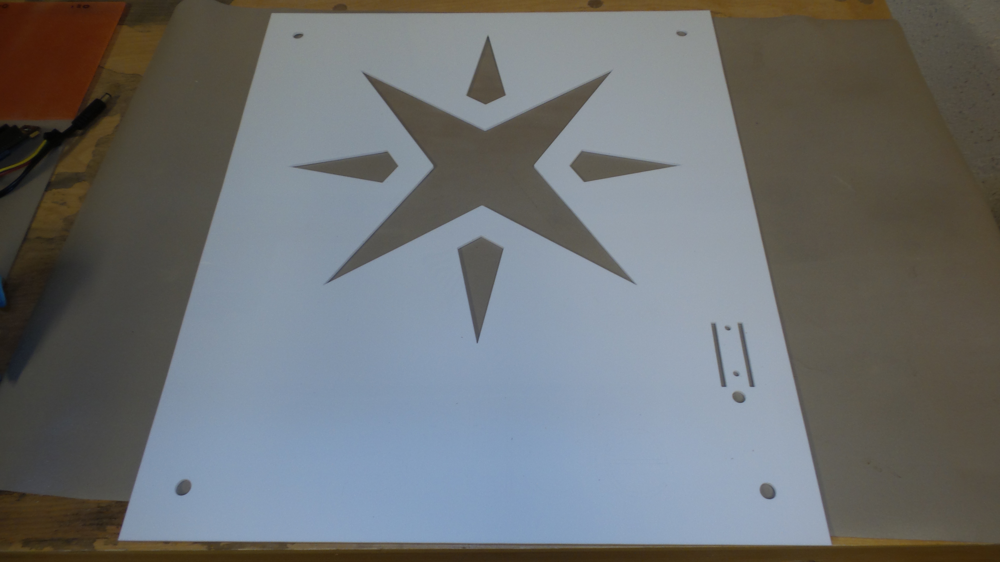

# Logomatic

## Make a logo come alive with full color animations

TODO: Better intro

This project combines many maker skills to create a logo sign using laser cut acrylic, a custom printed PCB to drive the LED string and software to play the animations and receive commands through the internet.

# Initial design

TODO: insert napkin drawing

The idea was to build the logo using laser cut acrylic in 3 layers and have LEDs shine through the logo.

The base layer would be opaque white with a hole in the shape of the logo and space for the name. It would also have holes for standoffs, fancy machined aluminium cylinders used to mount the sign to the wall.

The top layer would be frosted acrylic in the shape of the logo, but slightly larger than the hole. The top layer would also have the name in black to make it pop.

The bottom layer would be opaque white with a single strip of Neopixel LEDs cut and glued to it. The LEDs would shine through the top frosted layer.

The layers would be fastened together in some way that would be determined later.

I knew wiring the LEDs would be a pain, but it could be done with enough patience.

Since this was a Particle logo sign I wanted to show off the Particle

The software should be able to play GIF animations from an SD card and also perform so hard-coded animations like breathing a color like the Particle devices do when connected to the internet.

# Drawing template

Lay out the sign that you want to make in Inkscape or Illustrator. Add
the logo and text and the 4 standoffs in the corners. Use little
rectangles the same size as the LEDs to make a nice pattern.

## Laser cutting

When you are happy with the layout, copy the drawing and turn it into vectors that will be used to drive the laser cutter.

I needed 4 vectors. You can see them in `Mechanical/laser cutter vectors.svg`

First the letters are just cut in a piece of black acrylic.

Second the logo top layer is just cut in a piece of transparent acrylic. I rotated the points to save material.

Third is the base plate cut in a piece of white acrylic. The logo is hole is slighly smaller than the logo top layer. I did this in Inkscape by using Path -> Dynamic offset on the logo and shrinking the logo outline a bit. Using the same technique I made a shrunk down copy of the letters. Instead of cutting those I just etched them to know where to glue the black letters on the base plate.

Finally the back layer holding the LEDs is cut in a piece of white acrylic. The cut outline is made by using Dynamic offset and enlarging the logo. The logo hole and ideal placement of the LEDs are etched to ease assembly later.

Take the files to your local maker space and go cut some plastic!

Here's the result of cutting the base plate.

## Assembly

The owner of the plastics shop where I bought my acrylic in Ann Arbor told me that Weld On 4 was the best product for cleanly glueing acryclic. He sold me a small bottle with a seringe that has a goose neck. He mentioned not to use a seringe with a steel needle otherwise I'd need as many needles as drops of glue!

The trick to use Weld On 4 is to place the pieces together, inject a small amount at the seam and wait 3 seconds. That's all it takes to make a strong bond! Weld On 4 melts the acrylic so the 2 pieces become one.

I started by glueing the black letters on the base place using the etched letters on the base plate as a guide.

Before glueing the top logo I sanded the transparent acrylic with an orbital sander and 80 grit sandpaper. I used very little pressure not to create deep swirls on the surface. The result is a nicely frosted piece of acrylic.
